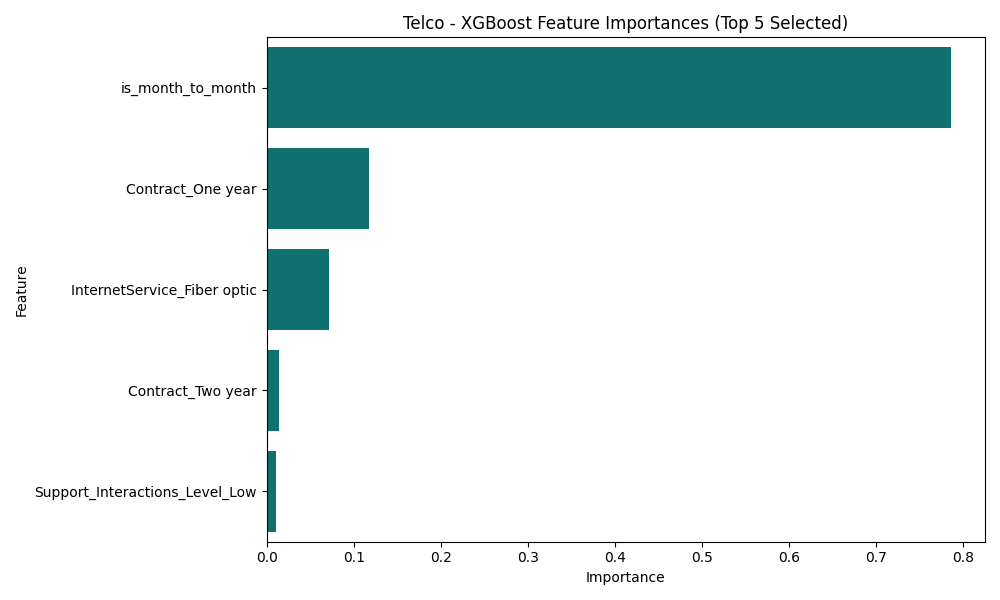
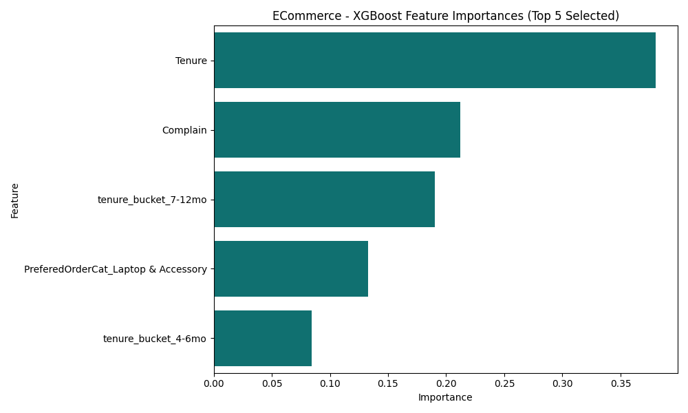

# 🚀 Customer Churn Prediction Pipeline

  

An end-to-end Machine Learning pipeline and interactive Streamlit web application designed to predict whether a customer will cancel their service (Churn). This project analyzes and models churn across two distinct industries: **Telecommunications** and **E-Commerce**.

---

## 📊 1. Overview & Business Problem
Customer acquisition is highly expensive; retaining existing customers is critical for profitability. The goal of this project is to analyze historical customer data, identify the key drivers behind why customers leave, and deploy a predictive Machine Learning model that can flag "High Risk" customers so the business can intervene (e.g., offering discounts or dedicated support) before they cancel.

### Dataset Sources
- **Telco Customer Churn:** [Kaggle Dataset](https://www.kaggle.com/datasets/blastchar/telco-customer-churn)
- **E-Commerce Customer Churn:** [Kaggle Dataset](https://www.kaggle.com/datasets/ankitverma2010/ecommerce-customer-churn-analysis-and-prediction)

---

## 📈 2. Analysis of Factors Influencing Churn (EDA)
During our Exploratory Data Analysis phase, we identified several critical behavioral patterns and thresholds that heavily influence churn rates.

### Telecommunications (Telco)
- **Contract Type is King:** Customers on a `Month-to-month` contract have staggeringly high churn rates compared to those locked into One or Two-year contracts.
- **Lack of Support:** Customers who do *not* have `TechSupport` or `OnlineSecurity` add-ons are much more likely to leave when they encounter issues.
- **Service Types:** Interestingly, customers with `Fiber optic` internet churn at a higher rate than DSL users. This is likely due to the higher monthly costs associated with Fiber and aggressive competitor pricing.

### E-Commerce
- **The Loyalty Threshold (Tenure):** Churn risk is incredibly high in the first 0-6 months. However, if a customer stays active beyond 6 months, their likelihood of churning plummets. 
- **Customer Satisfaction & Complaints:** A low `SatisfactionScore` on its own doesn't always guarantee churn, but when combined with a recent `Complain`, churn probability spikes drastically.
- **Order Categories:** Customers purchasing high-ticket items like `Laptop & Accessory` or `Mobile Phones` exhibit different retention patterns than everyday shoppers.

---

## 🧠 3. Methodology & Machine Learning Pipeline

### Data Cleaning & Leakage Prevention
Early models achieved an unrealistic **99.9% ROC-AUC** on the E-Commerce dataset. Investigation revealed over 550 identical duplicate rows in the raw data, allowing identical customers to leak into both the training and testing sets. We implemented a strict `drop_duplicates()` preprocessing step to eradicate this data leakage and ensure our model generalizes to truly unseen data.

### Feature Engineering
We constructed custom business-logic features to give the model deeper context:
- **`AvgCharge_vs_Monthly` (Telco):** Compares historical average monthly charge vs current charge to detect recent price spikes.
- **`high_risk_contract_no_support` (Telco):** Flags highly vulnerable users (Month-to-Month + No Tech Support).
- **`inactivity_flag` (E-Commerce):** Flags users who haven't ordered in 15+ days.
- **`tenure_bucket` (Both):** Buckets continuous numeric days/months into logical human thresholds (e.g., 0-3 months).

### Feature Selection (Optimizing for UI)
The raw datasets expanded to over 40 features after categorical encoding. A Streamlit dashboard requiring 40 manual inputs is unusable. We utilized `SelectFromModel` during training to force the algorithm to permanently drop everything except the **Top 5 most predictive features**. This traded a tiny fraction of accuracy for a massively cleaner, lightning-fast UI.

### Model Choice & Class Imbalance
- **Algorithm:** We established baselines with Logistic Regression but ultimately selected **XGBoost** as our final classifier due to its superior handling of non-linear tabular data.
- **Class Imbalance:** Only ~20% of customers actually churn. Rather than generating synthetic data (SMOTE), we utilized **Dynamic Class Weighting (`scale_pos_weight`)**. This mathematically punishes the model heavily if it fails to catch a churning customer.
- **Evaluation:** Models were evaluated using **5-Fold Stratified Cross-Validation** to guarantee unbiased metrics, optimizing specifically for **Recall**.

---

## 🎯 4. Results & Feature Importances

We optimized the pipeline for **Recall** (Sensitivity) because, from a business perspective, it is much cheaper to accidentally give a loyal customer a retention discount (False Positive) than it is to completely miss a churning customer and lose their revenue forever (False Negative).

### Telco Model Performance
- **ROC-AUC:** ~80.0%
- **Recall (Churners Caught):** ~76.0%

**Top 5 Features Driving Telco Predictions:**
1. Month-to-month Contract
2. 1-Year Contract
3. Fiber Optic Internet
4. 2-Year Contract
5. Low Support Interactions



### E-Commerce Model Performance
- **ROC-AUC:** ~87.5%
- **Recall (Churners Caught):** ~81.6%

**Top 5 Features Driving E-Commerce Predictions:**
1. Tenure (Months as a customer)
2. Has Complained recently
3. Tenure Bucket (7-12 months)
4. Preferred Order Category (Laptop & Accessory)
5. Tenure Bucket (4-6 months)



---

## 💻 5. Running the Application Locally

To run the interactive Streamlit dashboard and test the models yourself:

1. **Clone the repository:**
   ```bash
   git clone https://github.com/Baani-Arora/Customer-Churn-Prediction.git
   cd Customer-Churn-Prediction
   ```

2. **Install dependencies:**
   ```bash
   pip install -r requirements.txt
   ```

3. **Run the Streamlit App:**
   ```bash
   streamlit run app.py
   ```
